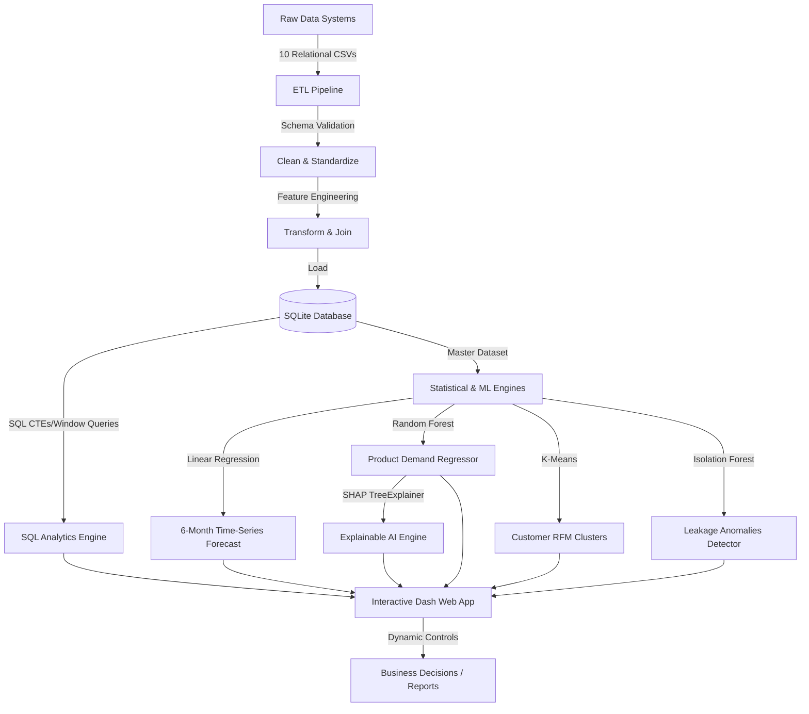

# Revenue Intelligence Suite (RIS)

A complete end-to-end Data Science and Business Analytics platform designed to simulate enterprise revenue operations, identify leakage, forecast revenue, segment customers, and support quantitative executive decisions.

This project is structured as a portfolio-ready demonstration showing clean data engineering (ETL), relational database schemas (SQL), statistical analysis, predictive machine learning, and explainable AI (SHAP) inside an interactive business dashboard.

---

## 1. Project Architecture & Data Flow



---

## 2. Folder Structure

```
Revenue IS/
│
├── assets/                  # Dash stylesheet assets & visual components
│   └── style.css
│
├── data/                    # Physical data warehouse storage layer
│   ├── raw/                 # Generated source systems CSVs (simulating CRM, ERP, Billing)
│   └── processed/
│
├── database/                # SQLite Relational Database Engine
│   └── revenue_intelligence.db
│
├── etl/                     # Extraction, Validation, Cleaning, & Load logic
│   ├── generate_data.py
│   └── pipeline.py
│
├── analytics/               # Database Execution & AI Explainability
│   ├── sql_executor.py
│   ├── statistics.py
│   ├── root_cause.py
│   ├── executive_insights.py
│   └── explainability.py    # SHAP feature contributions calculations
│
├── models/                  # Machine Learning algorithms
│   ├── saved/               # Serialized model pickles
│   ├── forecasting.py       # Time-series Linear Regression
│   ├── demand_prediction.py # Random Forest Regressor
│   ├── segmentation.py      # K-Means clustering
│   └── leakage_detector.py  # Isolation Forest anomaly detection
│
├── dashboard/               # Multi-page Dash layout
│   └── pages/
│       ├── overview.py
│       ├── revenue.py
│       ├── customers.py
│       ├── products.py
│       ├── leakage.py
│       ├── forecasting.py
│       └── report.py
│
├── sql/                     # Raw SQL CTE & Window Query files
│   ├── top_customers.sql
│   ├── top_products.sql
│   ├── worst_products.sql
│   ├── revenue_by_region.sql
│   ├── revenue_by_month.sql
│   └── revenue_leakage_by_category.sql
│
├── utils/                   # Visual layouts and styling variables
│   └── helpers.py
│
├── app.py                   # Master Dash application server entry
├── test_project.py          # Automated verification script
├── requirements.txt         # Dependencies list
└── README.md                # Documentation
```

---

## 3. Data Dictionary & Relational Schema

The raw layer is composed of 10 independent CSV datasets modeling relational database tables with proper primary keys (PK) and foreign keys (FK) representing typical enterprise operational boundaries:

### Relational Relationships Diagram

```
Customers (PK: customer_id)
   │
   └── (1:N) ──> Orders (PK: order_id; FK: customer_id, sales_rep_id, region_id)
                    │
                    ├── (1:N) ──> Order Items (PK: order_item_id; FK: order_id, product_id)
                    ├── (1:1) ──> Discounts (PK: discount_id; FK: order_id)
                    └── (1:1) ──> Returns (PK: return_id; FK: order_id)

Regions (PK: region_id)
   ├── (1:N) ──> Sales Representatives (PK: sales_rep_id; FK: region_id)
   ├── (1:N) ──> Marketing Spend (PK: spend_id; FK: region_id)
   └── (1:N) ──> Monthly Targets (PK: target_id; FK: region_id)

Products (PK: product_id)
   └── (1:N) ──> Order Items
```

### Table Definitions

| Dataset | Column Name | Type | Description | Key | Relationship | Business Meaning |
| :--- | :--- | :--- | :--- | :--- | :--- | :--- |
| **Customers** | `customer_id` | Text | Unique Customer Identifier | PK | | Unique CRM key |
| | `customer_name` | Text | Company Name | | | Corporate entity name |
| | `customer_segment` | Text | Customer Tier Classification | | | SMB, Strategic, Enterprise |
| | `created_date` | Date | Account Creation Date | | | Acquisition date |
| **Products** | `product_id` | Text | Unique Product Identifier | PK | | Catalog SKU |
| | `product_name` | Text | Product Name | | | Catalog label |
| | `category` | Text | Product Category | | | Software, Hardware, Consulting, Support |
| | `base_price` | Float | MSRP / List Price | | | Standard billing rate |
| | `cost_price` | Float | Internal COGS cost base | | | Minimum delivery cost |
| **Regions** | `region_id` | Text | Unique Region Identifier | PK | | Geographic Territory Code |
| | `region_name` | Text | Region Name | | | North America, Europe, APAC, LATAM |
| | `country` | Text | Target Representative Country | | | Headquarter Country |
| **Sales Reps** | `sales_rep_id` | Text | Unique Rep Identifier | PK | | Salesperson Code |
| | `sales_rep_name`| Text | Representative Name | | | Account Executive |
| | `region_id` | Text | Territory Link | | FK to Regions | Assigned Region |
| **Orders** | `order_id` | Text | Unique Order Identifier | PK | | Invoicing Number |
| | `customer_id` | Text | Buying Customer Link | | FK to Customers | CRM Customer Key |
| | `sales_rep_id` | Text | Associated Representative | | FK to Sales Reps | Owner Rep |
| | `region_id` | Text | Transaction Territory | | FK to Regions | Sale Location |
| | `order_date` | Date | Transaction Date | | | Order booking date |
| | `shipping_date`| Date | Shipping Completion Date | | | Logistics dispatch date |
| | `order_status` | Text | Order State | | | Completed, Returned, Cancelled |
| | `sales_channel`| Text | Distribution Vector | | | Direct, Online, Partner |
| | `delay_days` | Int | Logistical Processing Duration | | | Shipping duration in days |
| **Order Items**| `order_item_id`| Text | Unique Line Item Identifier | PK | | Invoice line item |
| | `order_id` | Text | Order Link | | FK to Orders | Invoice Link |
| | `product_id` | Text | Purchased Product SKU | | FK to Products | Catalog SKU Link |
| | `quantity` | Int | Quantity Ordered | | | Unit Count |
| | `unit_price` | Float | Actual Invoice Selling Price | | | Billed price per unit |
| **Discounts** | `discount_id` | Text | Unique Coupon Identifier | PK | | Marketing Coupon Key |
| | `order_id` | Text | Order Link | | FK to Orders | Order Link |
| | `discount_percentage` | Float | Discount percentage fraction | | | Percentage reduction (0.0 - 0.8) |
| | `discount_code`| Text | Discount Code Label | | | Marketing Code |
| **Returns** | `return_id` | Text | Unique Return Transaction | PK | | Return Code |
| | `order_id` | Text | Associated Order | | FK to Orders | Return Order Link |
| | `return_date` | Date | Return Check-In Date | | | Return booking date |
| | `return_reason`| Text | Reason for Refund Request | | | Defective, Wrong Item, unsatisfied, Late Delivery |
| **Marketing** | `spend_id` | Text | Unique Spend record | PK | | Ledger Entry |
| | `region_id` | Text | Spent Territory | | FK to Regions | Territory Allocation |
| | `campaign_month`| Text | Campaign Calendar Month | | | Budget period (YYYY-MM) |
| | `marketing_channel`| Text | Ad Network / Channel | | | SEO, PPC, Events, Email |
| | `spend_amount` | Float | Spent Capital | | | Campaign Expense |
| **Targets** | `target_id` | Text | Unique Target identifier | PK | | Target Entry |
| | `region_id` | Text | Target Territory | | FK to Regions | Target Allocation |
| | `target_month` | Text | Goal Calendar Month | | | Goal Period (YYYY-MM) |
| | `target_revenue`| Float | Target Sales Quota | | | Revenue target metric |

---

## 4. Extraction, Transformation, & Load (ETL)

The ETL process pipeline is defined in `etl/pipeline.py` and implements:
1. **Extraction**: Loads the 10 raw CSV files independently.
2. **Schema & Datatype Validation**: Verifies columns presence and strict datatype conformity (e.g. validating numeric fields are floats/ints, IDs are objects).
3. **Data Cleaning**: Deduplicates rows, standardizes timestamp formats, and handles logical nulls (replacing missing discount entries with 0.0 percentages and returns reasons with "N/A" strings).
4. **Calculated Analytical Transformations**:
   - `gross_revenue` = $Quantity \times UnitPrice$
   - `discount_amount` = $GrossRevenue \times DiscountPercentage$
   - `net_revenue` = $GrossRevenue - DiscountAmount$
   - `cost_amount` = $Quantity \times CostPrice$
   - `gross_profit` = $NetRevenue - CostAmount$
   - `profit_margin` = $GrossProfit / NetRevenue$
   - `leakage_amount` = $DiscountLeakage + ReturnLeakage + DelayLeakage + PricingLeakage$
     - *Discount Leakage*: Excess discount given above a standard 20% cap.
     - *Return Leakage*: Lost revenue from Returned items.
     - *Delay Leakage*: Lost revenue from Cancelled orders where shipping delay exceeded 5 days.
     - *Pricing Leakage*: Difference between catalog base price and billed price before discount.
   - *Engineered Features*: Customer Lifetime Value (CLV), Repeat Customer indicator, High-Risk Customer flag, Season/Quarter indicators.
5. **Loading**: Writes cleaned tables and a pre-joined `master_analytical_dataset` to the SQLite database.

---

## 5. Machine Learning Models

We deploy four practical, explainable Machine Learning algorithms:

1. **6-Month Revenue Forecasting**: A time-series forecasting model using **Linear Regression**. Features include trend values, monthly lag variables (lags of 1, 2, and 3 months), and sine/cosine monthly transforms to capture seasonality. Includes confidence intervals based on residuals standard error.
2. **Demand Prediction**: A **Random Forest Regressor** model trained to predict product item quantities sold per order based on categories, unit prices, discounts, target regions, sales channels, and seasonal month numbers.
3. **Customer Segmentation**: A **K-Means Clustering** model clustering customers into 4 distinct marketing personas:
   - *VIP High-Value*: High frequency, high monetary volume, low return rates.
   - *Discount Seekers*: High discount rates, low/medium monetary volumes.
   - *High Return Risk*: High return percentages.
   - *Standard Customers*: Average balanced indicators.
4. **Revenue Leakage Anomaly Detection**: An **Isolation Forest** model to perform unsupervised pricing and shipping delay audits, flagging highly anomalous transaction profiles.

---

## 6. Explainable AI (SHAP)

To explain the predictions of the Random Forest Demand Regressor, we utilize the **SHAP** library:
- **Global Importance**: Calculates the average absolute SHAP values across features to determine which business driver carries the highest weight in model decisions.
- **Local Waterfall Explanations**: Calculates SHAP values for a single selected order transaction. Dash parses these feature contributions to render a Plotly Waterfall chart, mapping how unit price, category, region, and channel parameters pushed the order quantity up or down relative to the baseline dataset average.

---

## 7. How to Install and Run

### Prerequisites
- Python 3.9, 3.10, or 3.11.

### Setup Steps
1. **Clone or Download** the project to your workspace directory.
2. **Install Dependencies**:
   ```bash
   pip install -r requirements.txt
   ```
3. **Run Automated Verification Tests**:
   ```bash
   python test_project.py
   ```
4. **Launch the Dashboard Application**:
   ```bash
   python app.py
   ```
5. **Open Web Browser**:
   Navigate to `http://127.0.0.1:8050/` to explore the interactive interface.
